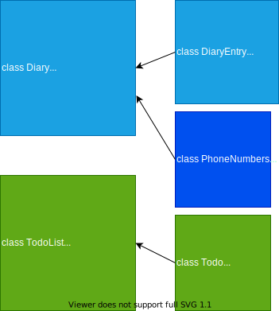

{{PROBLEM}} Multi-Class Planned Design Recipe

1. Describe the Problem

As a user
So that I can record my experiences
I want to keep a regular diary

As a user
So that I can reflect on my experiences
I want to read my past diary entries

As a user
So that I can reflect on my experiences in my busy day
I want to select diary entries to read based on how much time I have and my reading speed

<!-- # As a user
# So that I can keep track of my tasks
# I want to keep a todo list along with my diary -->

As a user
So that I can keep track of my contacts
I want to see a list of all of the mobile phone numbers in all my diary entries

2. Design the Class System

class Diary
    def initialize
        #Stores entries
    end

    def add(entry)
        #receives an instance of DiaryEntry
        #Adds to list of entries.
    end

    def all_entries
        #returns entries
    end

    def readable_entry(wpm, mins)
        #will need wpm / minutes avaialable
        #calls reading_time
        #returns readable entry
    end

    def phone_numbers
<!-- *        # behaviour to be determind...
    end -->
end

class DiaryEntry
    def initialize(title, contents)
        #Stores a title and contents
    end

    def title
        #returns title
    end

    def contents
        #returns contents
    end

    def word_counter   # <- May need moving to Diary
        #returns number of words in contents
    end

    def reading_time(wpm) # <- May need moving to Diary
        # returns how long to read a given item
        #will require wpm
        #calls word_counter
    end
end 

class PhoneNumbers
    def initialize
        #has a list of numbers
    end

    def list
        #returns list of numbers
    end

    def check_for_number(diary_text)
        #receives a diary entry
        #scans entry for a number
        #checks number is correct
        #if valid sends to list
    end
end

3. Create Examples as Integration Tests

#Integration Test

#Diary -> DiaryEntry
#1 - adds diary entries to the diary
diary = Diary.new
entry_1 = DiaryEntry.new("A Title", "Some contents.")
entry_2 = DiaryEntry.new("A Title", "Some more contents here.")
diary.add(entry_1)
diary.add(entry_2)
expect(diary.all_entries) # => [entry_1, entry_2]

#2 - can identify the number of words in an entry
diary = Diary.new
entry_1 = DiaryEntry.new("A Title", "Some contents.")
diary.add(entry_1)
result = diary.word_counter # <- May need a seperate method in Diary?
expect(result) # => 2

#3 - can identify the time to read an entry based on a given wpm
diary = Diary.new
entry_1 = DiaryEntry.new("A Title", "Some contents.")
diary.add(entry_1)
result = diary.reading_time(2) # <- May need a seperate method in Diary?
expect(result) # => 1

#4 - can return a readable entry within a given time
diary = Diary.new
entry_1 = DiaryEntry.new("A Title", "Some contents.")
entry_2 = DiaryEntry.new("A Title", "Some more contents here.")
diary.add(entry_1)
diary.add(entry_2)
result = diary.readable_entry(2, 1) #Can read 2 wpm, have 1 minute available
expect(result) # => [entry_1]

DiaryEntry -> PhoneNumbers
#1 - It can store a phone number
number = PhoneNumbers.new
entry_1 = DiaryEntry.new("A Title", "Some contents with a number, 07801000100.")
contents = entry_1.contents
check = number.check_for_number(contents)
result = number.list
expect(result) # => [07801000100]

PhoneNumbers -> Diary
#1 - It can return a list of numbers
number = PhoneNumbers.new
diary = DiaryEntry.new
entry_1 = DiaryEntry.new("A Title", "Some contents with a number, 07801000100.")
diary.add(entry_1)
contents = entry_1.contents
check = number.check_for_number(contents)
result = number.list

4. Create Examples as Unit Tests

#Diary

#1 - It initializes
diary = Diary.new
expect(Diary) # => diary

#2 - Has an empty array after intializing
diary = Diary.new
expect(diary.all_entries)  # => []

#DiaryEntry

#1 - Constructs a diary entry
entry = DiaryEntry.new("title", "contents")
expect(entry.title) # => "title"
expect(entry.contents) # => "contents"

#2 - Can count the number of words in an entry
entry = DiaryEntry.new("title", "Some contents.")
expect(entry.word_counter)  # => 2

#3 - Can calculate reading time
entry = DiaryEntry.new("title", "Some contents.")
result = entry.reading_time(2) # 2 wpm
expect(result)  # => 1 #1 minute

5. Implement the Behaviour

After each test you write, follow the test-driving process of red, green, refactor to implement the behaviour.